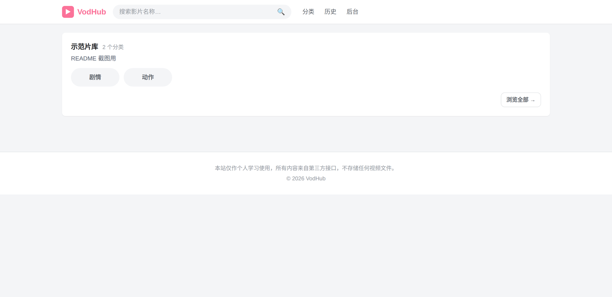
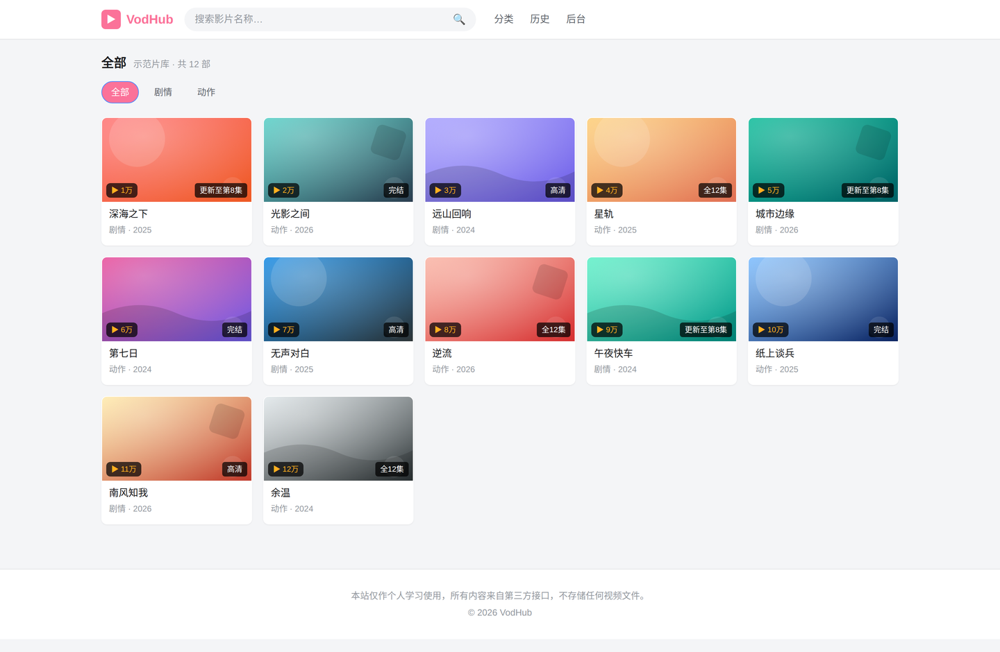
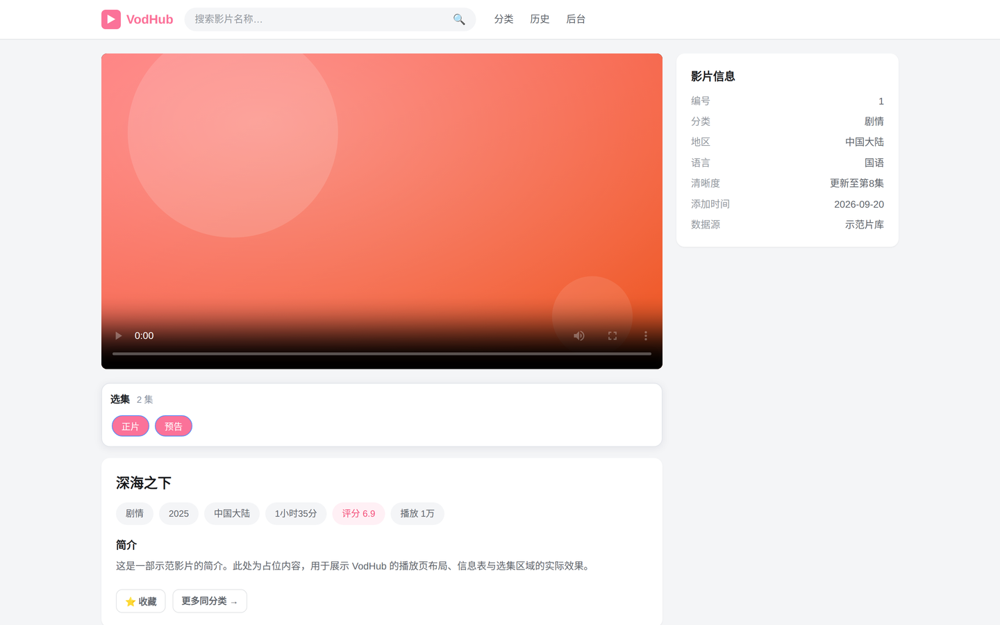
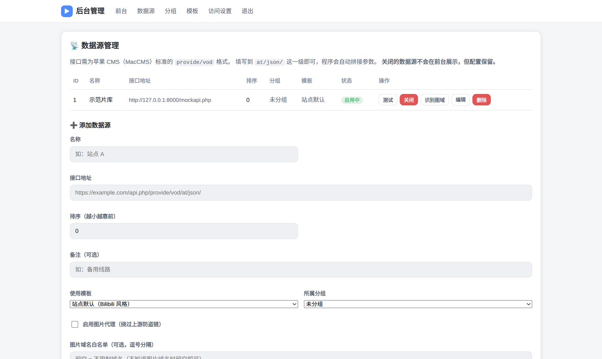

<div align="center">

# VodHub

**纯 PHP 自托管影视聚合站 —— 不存储任何视频，只聚合你自己的接口**

[](LICENSE)
[](config.php)
[](#-环境要求)
[](https://github.com/hopol/VodHub/actions/workflows/ci.yml)
[](CONTRIBUTING.md)

[快速开始](#-快速开始) · [在线文档](docs/) · [模板开发](docs/templates.md) · [提交 Issue](https://github.com/hopol/VodHub/issues)

</div>

---

## 📸 界面预览

| 分类浏览 | 内容列表 |
|:---:|:---:|
|  |  |

| 播放页 | 管理后台 |
|:---:|:---:|
|  |  |

> 截图取自 `bilibili` 模板（浅色宽图）。5 套模板可在后台「模板管理」里切换预览。

---

## 这是什么

VodHub 是一个**你自己部署**的影视聚合站。它从你在后台配置的第三方 API 接口拉取影片元数据（标题、封面、简介、播放地址），统一渲染成一个站。

**它不存储、不缓存、不转码任何视频文件**——播放时直接把接口返回的 `m3u8` 地址交给浏览器。所以本体极轻：

- **零 Composer 依赖**，纯 PHP 标准库 + SQLite
- **零前端框架**，原生 CSS + 原生 JS
- **hls.js 本地化**，不依赖任何国外 CDN
- 整个项目 **< 1 MB**，扔进虚拟主机的 `htdocs` 就能跑

## ✨ 特性

### 数据源

- 📡 支持苹果 CMS（MacCMS）标准 `provide/vod` 格式接口，一条 SQL 都不用写
- ⚡ **一键测试连接**：测延迟、测是否返回内容
- ⏯ **一键启用/关闭**：关掉的源保留配置但不再前台展示
- 🗂 **分组**：源多了以后顶部标签会挤，按「影视 / 短视频」分组归类
- 🖼 **图片代理**：按源独立开关，绕过上游防盗链；**白名单留空即可用**（内网地址仍自动拦截）
- 🔍 **识别图域**：不确定图片域名？一键从该源最近内容里自动抓出来写进白名单

### 模板系统

5 套模板开箱即用，每个数据源可**单独绑定**不同模板：

| 模板 | 风格 | 封面 |
|------|------|------|
| `default` | 深色主题 | 竖图 2:3 |
| `bilibili` | 浅色粉色（参照 B 站） | 宽图 16:9 |
| `douban` | 白底绿色，横向列表 | 宽图 |
| `iqiyi` | 白底绿色，网格卡片 | 3:4 |
| `netflix` | 深红密集网格 | 2:3 |

> **为什么需要多模板？** 不同接口的 `vod_pic` 封面比例不一样——有的是竖图，有的是横图。竖图塞进 16:9 的框会被裁掉两侧，横图塞进 2:3 会留一大片白。**按源绑定模板**，各显示各的正确比例。

- 🎨 后台可视化改样式（主题色 / 圆角 / 封面比例 / 列数），**不用碰 CSS 文件**
- ♻️ 恢复默认样式一键还原
- 🧩 新增模板 = 复制一个目录改名字，详见 [模板开发文档](docs/templates.md)

### 站点

- 🔐 访问密码保护（可开关）+ 管理后台独立密码
- 🕐 播放历史与收藏 —— 存在浏览器 localStorage，**不上传服务器**
- 🗄 列表 / 详情 / 分类三级缓存（SQLite 之外的文件缓存），上游故障时自动降级用旧数据
- 📱 移动端自适应，播放页选集自动换行

## 📦 环境要求

| 项目 | 要求 |
|------|------|
| PHP | **8.0 及以上** |
| 扩展 | `curl`、`pdo_sqlite` |
| 数据库 | 无需安装，自动使用 SQLite（文件落在 `runtime/`） |
| Web 服务器 | Apache / Nginx 均可 |
| Composer | **不需要** |
| Node.js | **不需要** |

## 🚀 快速开始

### 方式一：虚拟主机（最简单）

1. 下载源码上传到 `htdocs/`
2. 给 `runtime/` 赋写权限：`chmod -R 755 runtime`（面板里点「可写」也行）
3. 浏览器打开站点，默认管理后台：`/admin.php`
4. 默认密码 **`admin123`** —— **进去第一件事就是改掉它**

> 没有 `runtime/` 目录？程序会自动创建；只要保证站点根目录可写即可。

### 方式二：Nginx

```nginx
server {
    listen 80;
    server_name example.com;
    root /var/www/VodHub;
    index index.php;

    location / {
        try_files $uri $uri/ /index.php?$query_string;
    }

    location ~ \.php$ {
        fastcgi_pass unix:/run/php/php8.2-fpm.sock;
        include fastcgi_params;
        fastcgi_param SCRIPT_FILENAME $document_root$fastcgi_script_name;
    }

    # 运行期数据不对外
    location ^~ /runtime/ { deny all; }
}
```

Apache 用户 `.htaccess` 已内置，无需额外配置。

### 装好之后

1. **改管理密码**（后台 → 访问设置 → 修改管理密码）
2. **添加数据源**（后台 → 数据源管理 → 接口地址填到 `at/json/` 这一级）
3. 点「测试」确认通了，再「启用」
4. 觉得封面显示不好看？给这个源**绑定一个合适的模板**

## 📚 文档

| 文档 | 内容 |
|------|------|
| [部署指南](docs/deployment.md) | 虚拟主机 / Nginx / 权限 / HTTPS / 反向代理 |
| [配置说明](docs/configuration.md) | 每个后台设置项的含义与建议值 |
| [数据源接入](docs/api-sources.md) | 接口格式要求、封面比例选择、图片代理怎么用 |
| [模板开发](docs/templates.md) | 从零写一套模板，CSS 变量编辑器如何对接 |
| [故障排查](docs/troubleshooting.md) | 白屏、图片挂了、模板不生效……对照表 |

## 🗂 项目结构

```
VodHub/
├── index.php / list.php / play.php / search.php ...   # 前台页面（只管取数据）
├── admin.php                                          # 后台入口
├── config.php                                         # 全局配置（PHP 版本保护 + 路径常量）
├── includes/
│   ├── db.php               # SQLite 封装 + 自动表结构迁移
│   ├── client.php           # 上游接口客户端（请求、缓存、降级）
│   ├── template.php         # 模板发现 / 解析 / 加载
│   ├── admin-actions.php    # 后台所有 POST 动作分发
│   ├── auth.php             # 鉴权 + CSRF
│   └── functions.php        # 工具函数
├── templates/
│   └── <模板名>/
│       ├── theme.json       # 元信息（名称、封面模式、列数）
│       ├── header.php / footer.php / index.php ...
│       ├── style.css        # 模板专属样式（CSS 变量在这里定义）
│       └── partials/        # 可复用片段
├── static/                  # 公共样式、app.js、hls.js（本地化）
└── runtime/                 # 【不入库】SQLite + 缓存
```

**设计原则**：页面只负责取数据，渲染全交给模板系统。模板目录自包含，复制一份改个名就是新模板。

## 🤝 参与贡献

欢迎 Issue 和 PR！请先看 [贡献指南](CONTRIBUTING.md)，提交前：

- [ ] `php -l` 语法检查通过（CI 会自动跑）
- [ ] 新功能附带说明 / 截图
- [ ] 不要把 `runtime/` 里的文件提交进来

## 🔒 安全

请勿通过公开 Issue 报告安全漏洞，查看 [安全策略](SECURITY.md)。

## 📄 协议

本项目采用 [**GNU GPL-3.0**](LICENSE) 协议发布，© **HopoL**（2026）。

**GPL-3.0 是一份带传染性的强 copyleft 协议** —— 这是本项目刻意的选择：

| 你可以 ✅ | 你必须 ⚠️ |
|----------|----------|
| 自由使用、复制、运行本项目 | **衍生作品必须同样以 GPL-3.0 开源** |
| 自由修改源码 | 必须向你的用户提供完整源码 |
| 自由分发（含商业分发） | 必须保留原有的版权声明与协议文本 |
| 用它搭建你自己的站点 | 不得附加额外限制、不得授予额外专利授权 |

> **什么算"衍生作品"？** 基于本项目代码修改、扩展、二次开发的作品；把它作为组件整体分发的作品。
>
> **什么不算？** 你通过本项目部署出的**站点本身**、你配置的数据源、你在后台填写的内容 —— 那些是**数据**，不受本项目协议约束。
>
> 详见 [LICENSE](LICENSE) 全文，或阅读 [GPL-3.0 官方说明](https://www.gnu.org/licenses/gpl-3.0.zh-cn.html)。

贡献代码即表示你同意以 GPL-3.0 授权你的改动（见 [贡献指南](CONTRIBUTING.md)）。

---

<div align="center">
<sub>本站仅供个人学习自建使用，请勿用于任何商业或侵权用途。内容全部来自你自行配置的第三方接口，本站不存储任何视频文件。</sub>
</div>
